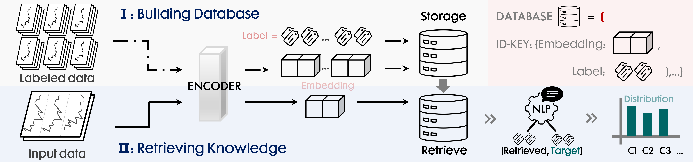

# Modular Retrieval-Augmented Generalization for Human Activity Recognition

## Overview
This repository contains the implementation of **MoRA**, a novel **Retrieval-Augmented Module** designed for Inertial Measurement Unit (IMU)-based Human Activity Recognition (HAR). MoRA addresses critical challenges in IMU-based HAR, such as limited training samples and static knowledge utilization, by introducing a flexible, plug-and-play module that enhances recognition performance while maintaining inference efficiency. Our paper has been accepted by **ICME 2026**.

## Workflow
[]

## Features
- **Modular Design**: MoRA can be seamlessly integrated into any existing IMU-based HAR model.
- **Uncertainty-Adaptive Fusion**: Dynamically adjusts fusion strategies to handle information redundancy and improve robustness.
- **Enhanced Performance**: Demonstrated significant improvements across ten real-world datasets.
- **Inference Efficiency**: Maintains low computational overhead, making it suitable for large-scale deployment.

## Installation
The full codebase will be released after the ICME 2026 anonymization period. Below is a placeholder for the installation instructions, which will be updated once the code is public.

```bash
# Installation instructions will be provided post-anonymization.
# Expected dependencies: Python 3.8+, PyTorch, NumPy, etc.
```

## Usage
To run MoRA for training and evaluation on IMU-based HAR datasets, execute the main script with the following command and parameters:

```bash
python ./MoRA/main.py --device cuda:0 --model_name unimts_model --batch_size 256 --lr 1e-4 --num_epochs 50 --n_shot 5 --alpha 0.5 --checkpoint ./baselines/checkpoints --load_method combine
```

**Key Parameters**:
- `--device`: Device to run the model (e.g., `cuda:0` or `cpu`).
- `--model_name`: Base HAR model (e.g., `unimts_model`, `tslanet`, `tcn`).
- `--batch_size`: Batch size for training (default: `256`).
- `--lr`: Learning rate (default: `1e-4` for `unimts_model`).
- `--num_epochs`: Number of training epochs (default: `50`).
- `--n_shot`: Number of shots for few-shot learning (e.g., `5`).
- `--alpha`: Weight for combining IMU and text logits (default: `0.5`).
- `--checkpoint`: Directory to save model checkpoints (default: `./baselines/checkpoints`).
- `--load_method`: Data loading method (`split` or `combine`, default: `combine`).

## Datasets
MoRA has been evaluated on **ten real-world datasets** for IMU-based HAR. Details of the datasets and experimental setups will be provided in the full codebase release.

## Experiments
Our experiments demonstrate that MoRA consistently improves the performance of existing IMU-based HAR models across diverse architectures and task settings. Key highlights:
- **Significant Performance Gains**: Stable improvements in accuracy and robustness.
- **Flexible Integration**: Works with various model architectures (e.g., CNNs, RNNs, Transformers).
- **Efficient Inference**: Minimal computational overhead compared to baseline models.

## Citation
If you find our work useful, please cite our ICME 2026 paper:

```bibtex
@inproceedings{liao2026mora,
  title        = {Modular Retrieval-Augmented Generalization for Human Activity Recognition},
  author       = {Peng Liao and Shangsong Liang and Lin Chen and Peijia Zheng},
  booktitle    = {Proceedings of the IEEE International Conference on Multimedia \& Expo (ICME)},
  year         = {2026}
}
```

## License
This project will be licensed under the MIT License upon full code release.
